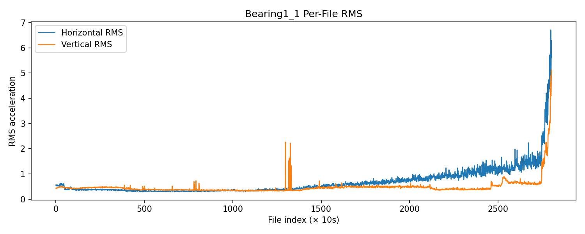
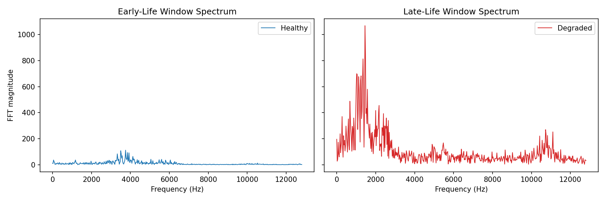
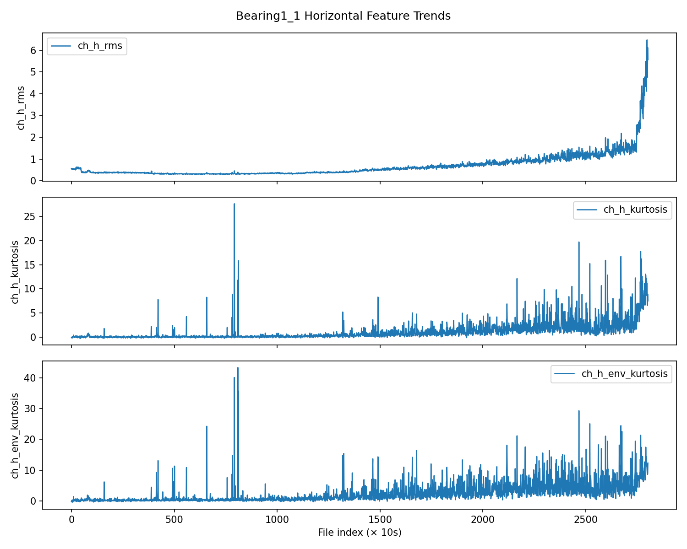
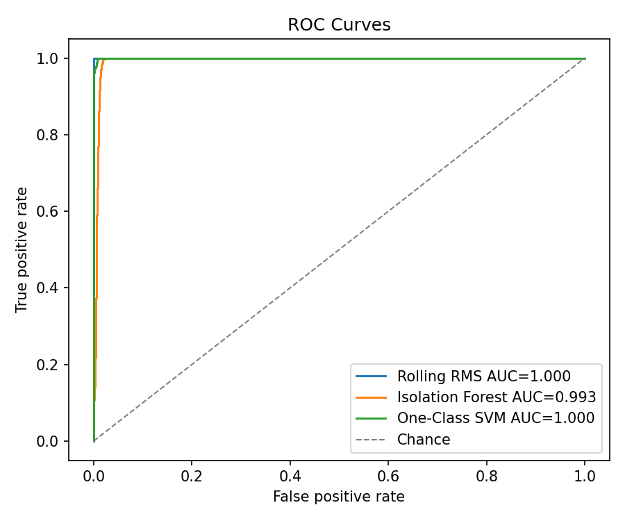
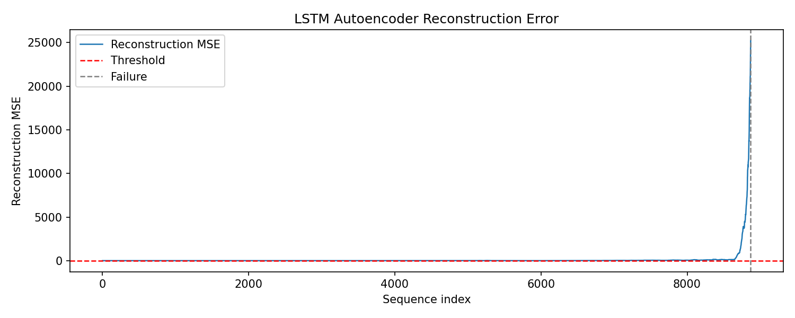
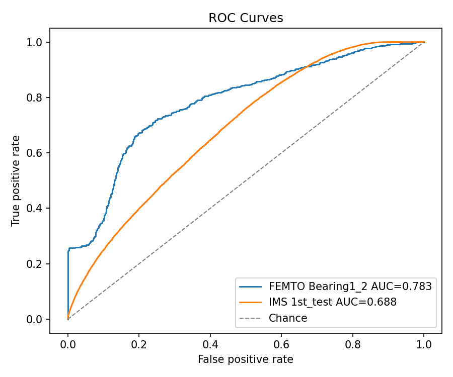
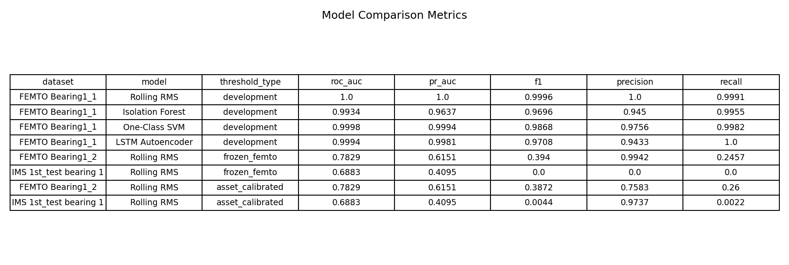

# Vibration-Based Anomaly Detection for Structural Health Monitoring

Semi-supervised vibration anomaly detection for bearing health monitoring. The project starts from raw run-to-failure vibration files, extracts signal-processing features, trains anomaly detectors only on early healthy operation, and evaluates how well fixed thresholds transfer beyond the development bearing.

The central result is intentionally practical: a simple Rolling RMS threshold is extremely strong on the development FEMTO bearing, but direct threshold transfer to another FEMTO bearing and IMS is weak. This is a useful SHM finding, not a failure to hide.

## Datasets

| Dataset | Role | Use in this project |
|---|---:|---|
| FEMTO Bearing Dataset | Primary | Training, threshold selection, validation, main evaluation |
| IMS Bearing Dataset | Cross-dataset stress test | Evaluation only, never used for fitting or threshold tuning |

Raw data is expected under:

```text
data/raw/FEMTO/
data/raw/IMS/
```

IMS must be extracted so that `data/raw/IMS/4. Bearings/1st_test/` contains the sequential raw vibration files.

## Method

This is anomaly detection, not supervised fault classification.

Training uses only early-life healthy data from FEMTO `Bearing1_1`. Evaluation labels are derived from lifetime position:

| Lifetime region | Label | Use |
|---|---:|---|
| First 60% | 0 | Healthy training/evaluation |
| Middle 20% | excluded | Transition zone |
| Last 20% | 1 | Degraded/failing evaluation |

Compared methods:

| Method | Input | Anomaly score |
|---|---|---|
| Rolling RMS | horizontal RMS | raw RMS value |
| Isolation Forest | engineered features | negative `decision_function()` |
| One-Class SVM | engineered features | negative `decision_function()` |
| LSTM Autoencoder | feature sequences | reconstruction MSE |

Engineered features include time-domain statistics, Welch spectral features, FFT band energies, and Hilbert-envelope statistics.

## Key Figures

### FEMTO Bearing1_1 EDA





### Feature Trends And Model Diagnostics







### Cross-Dataset Transfer





## Results

### Development Bearing: FEMTO Bearing1_1

Thresholds and models were selected only on `Bearing1_1`.

| Model | ROC-AUC | PR-AUC | F1 | Precision | Recall |
|---|---:|---:|---:|---:|---:|
| Rolling RMS | 1.0000 | 1.0000 | 0.9996 | 1.0000 | 0.9991 |
| Isolation Forest | 0.9934 | 0.9637 | 0.9696 | 0.9450 | 0.9955 |
| One-Class SVM | 0.9998 | 0.9994 | 0.9868 | 0.9756 | 0.9982 |
| LSTM Autoencoder | 0.9994 | 0.9981 | 0.9708 | 0.9433 | 1.0000 |

Rolling RMS achieves ROC-AUC 1.0 on the development bearing because FEMTO Bearing1_1 exhibits a near-instantaneous amplitude spike in the final files; this is a dataset property, not evidence of overfitting.

Rolling RMS is the best development model. The LSTM autoencoder works, but it does not beat the energy baseline on this bearing.

### Frozen Threshold Transfer

The best FEMTO `Bearing1_1` threshold was frozen and applied without tuning.

| Dataset | Model | Threshold | ROC-AUC | PR-AUC | F1 | Precision | Recall |
|---|---|---:|---:|---:|---:|---:|---:|
| FEMTO Bearing1_2 | Rolling RMS | 0.7473 | 0.7829 | 0.6151 | 0.3940 | 0.9942 | 0.2457 |
| IMS 1st_test bearing 1 | Rolling RMS | 0.7473 | 0.6883 | 0.4095 | 0.0000 | 0.0000 | 0.0000 |

The frozen threshold does not generalize well. It is too strict for IMS and misses the labeled degraded region entirely at the chosen operating point.

### Asset-Calibrated Thresholds

For a more realistic SHM deployment, a local threshold was estimated from early healthy operation:

`threshold = mean(healthy score) + 3 * std(healthy score)`

| Dataset | Local threshold | ROC-AUC | PR-AUC | F1 | Precision | Recall |
|---|---:|---:|---:|---:|---:|---:|
| FEMTO Bearing1_2 | 0.5240 | 0.7829 | 0.6151 | 0.3872 | 0.7583 | 0.2600 |
| IMS 1st_test bearing 1 | 0.1817 | 0.6883 | 0.4095 | 0.0044 | 0.9737 | 0.0022 |

Asset calibration changes the threshold scale, but it does not solve IMS generalization. The score ranking has some signal on IMS, but detection at a fixed threshold is still poor.

## Interpretation

1. **RMS is a serious baseline.** On FEMTO `Bearing1_1`, degradation is strongly expressed as increasing vibration energy, so Rolling RMS is hard to beat.
2. **The LSTM autoencoder is not automatically better.** It reconstructs healthy windows and separates late-life windows well, but its F1 is below Rolling RMS on the development bearing.
3. **Threshold transfer is the weak point.** A fixed absolute threshold learned on one bearing does not carry reliably to another bearing or another dataset.
4. **IMS is a domain-shift stress test.** The IMS result should be read as evidence that asset-specific calibration and domain adaptation matter in practical SHM.

## Reproducible Pipeline

Run notebooks in order:

```powershell
python -m nbconvert --to notebook --execute notebooks/01_eda.ipynb --inplace
python -m nbconvert --to notebook --execute notebooks/02_feature_engineering.ipynb --inplace
python -m nbconvert --to notebook --execute notebooks/03_baseline_models.ipynb --inplace
python -m nbconvert --to notebook --execute notebooks/04_lstm_autoencoder.ipynb --inplace
python -m nbconvert --to notebook --execute notebooks/05_evaluation_and_comparison.ipynb --inplace
```

Install dependencies:

```powershell
python -m pip install -r requirements.txt
```

## Generated Artifacts

| Path | Contents |
|---|---|
| `data/processed/femto_features_all_bearings.parquet` | FEMTO engineered window features |
| `data/processed/ims_1st_test_b1_features.parquet` | IMS bearing 1 engineered window features |
| `models/checkpoints/lstm_ae_bearing1_1.pt` | LSTM autoencoder weights, scaler stats, threshold |
| `models/metrics/baseline_metrics.csv` | FEMTO baseline metrics |
| `models/metrics/lstm_ae_metrics.csv` | FEMTO LSTM-AE metrics |
| `models/metrics/cross_dataset_metrics.csv` | FEMTO/IMS transfer metrics |
| `models/metrics/final_comparison_metrics.csv` | Combined final metrics |
| `reports/figures/` | Diagnostic plots |
| `reports/tables/final_model_comparison_table.png` | Final rendered comparison table |

## Project Structure

```text
vibration-anomaly-detection/
├── README.md
├── requirements.txt
├── data/
│   ├── raw/
│   │   ├── FEMTO/
│   │   └── IMS/
│   └── processed/
├── notebooks/
├── src/
│   ├── config.py
│   ├── data/
│   ├── features/
│   ├── models/
│   └── visualization/
├── models/
│   ├── checkpoints/
│   └── metrics/
└── reports/
    ├── figures/
    └── tables/
```

## Limitations

- Evaluation labels are time-derived, not physical fault annotations.
- The transition zone is excluded, so reported metrics measure separation between early healthy and late degraded windows.
- The FEMTO development result is very strong because late-life vibration energy rises sharply.
- IMS transfer remains weak, even with local threshold calibration.
- This project does not claim a deployable universal bearing monitor; it demonstrates a reproducible SHM pipeline and the importance of threshold calibration under domain shift.
